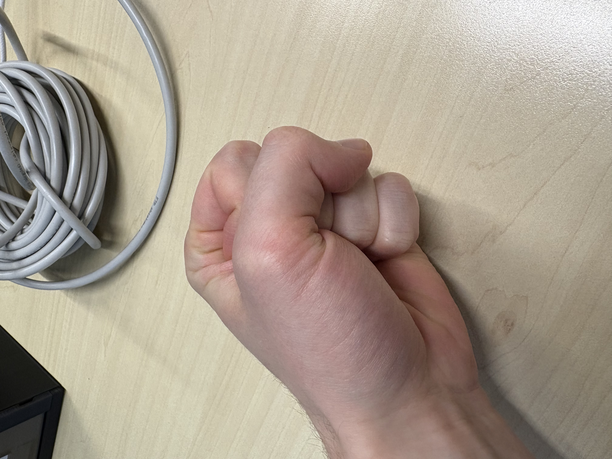
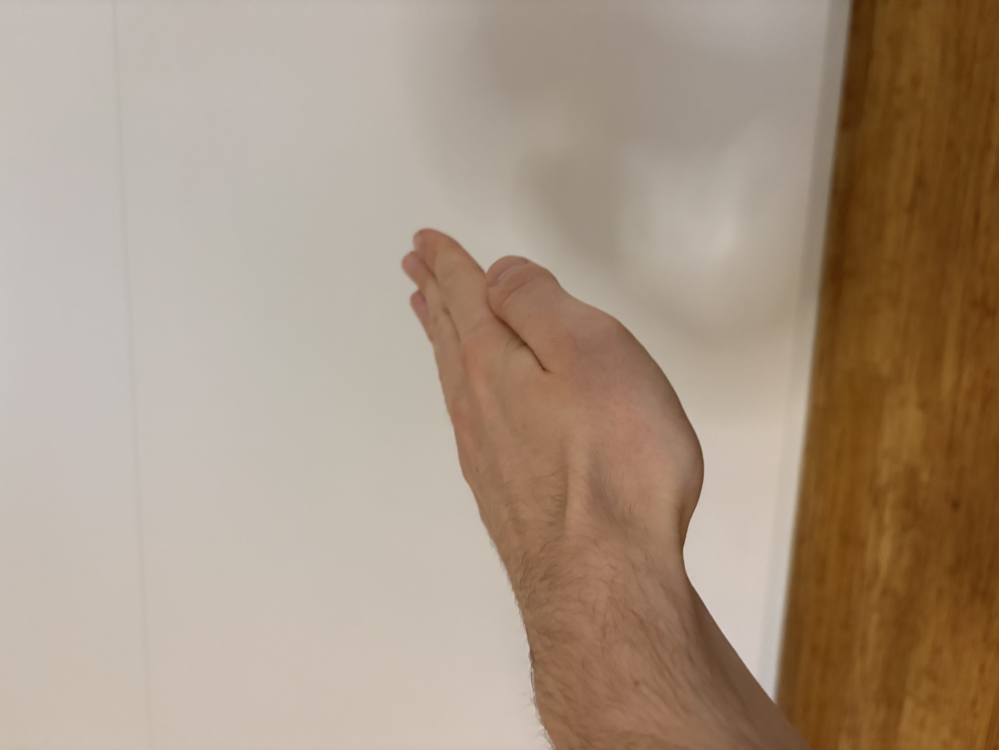
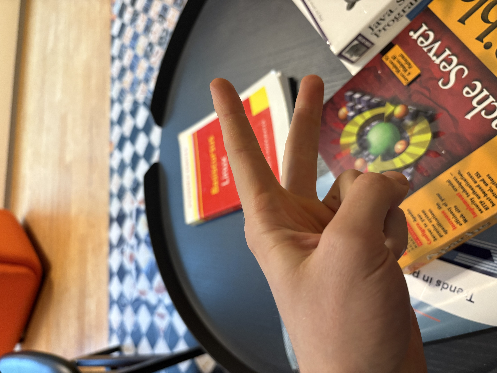
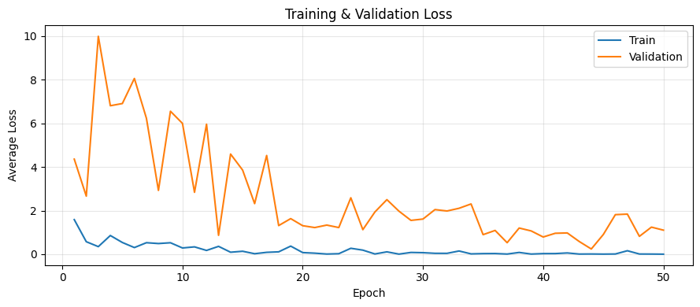

# rock-paper-scissors-cv
This is a super short toy project on training an existing [ImageNet](https://www.image-net.org/)-trained computer vision model to classify hand gestures as either Rock, Paper, or Scissors. It goes through all basic CV pipeline steps:
1. Data acquisition
2. Data preprocessing
3. Pre-trained model setup
4. Data augmentation
5. Training, validation, evaluation

The code to run can either be found in `main.py` or in `rock_paper_scissors_training.ipynb` if you prefer a notebook.

## 1. Data acquisition
The dataset contains a whopping 45 pictures I made at the office of my hand doing either rock, paper or scissors. I varied angles and backgrounds for increased challenge.

rock|paper|scissors
---|---|---
||

I split this dataset in 30 samples for training, 6 for validation, 6 for evaluation. 

## 2. Data preprocessing
Phone pictures are rather high-quality and large for a toy project. I downscaled them by using `preprocess_raw_pictures.py`:
```sh
python preprocess_raw_pictures.py ./rps_dataset_raw ./rps_dataset
```

## 3. Pre-trained model setup
The idea was to do transfer learning on a very simple pre-trained model. I picked ResNet18 because it is small and probably good enough.

For fine-tuning I replaced the final linear layer (FC) with one that only has three outputs (rock, paper, and scissors, respectively) and I froze all parameters except those of the 4th and last set of convolutional layers.

The following figure is from wikipedia and gives an overview of ResNet18 (read from bottom to top):


## 4. Data augmentation
Given that my custom dataset is ***tiny***, it is very(!) necessary to perform data augmentation. Otherwise the model will likely not perform well on the test set and the validation set.

Types of data augmentation used: random cropping + two random choices from the list:

1. Random horizontal flip
2. Random color jitter
3. Random rotation
4. Random grayscale


## 5. Training, validation, evaluation
I fine-tuned the model for 50 epochs. The following is a plot with the train loss and the validation loss plotted for a particular run:


This particular run got a 100% test accuracy (6/6). This is not entirely representative. When running the same test multiple times with different seeds, test accuracy is typically within the range 66%-100% (4/6-6/6).

This result is clearly not amazing, but given the little time I spent on this I am pretty happy that it consistently scores better than random (which would be 33% accuracy).

## Conclusion
This was cute and fun. I should do more small projects 🙈


